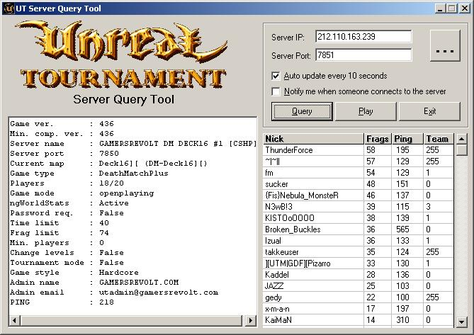



## Unreal Tournament Server Browser

### Description

This program is a standalone server browser for Unreal Tournament game servers. You can use it to maintain a list with your favorite UT servers and quickly see who's online. It uses the winsock control and the UDP protocol to query the computer running the UT server. I think it is a good example on how to handle the UDP protocol,how to verify that all the packets of the server's response have arrived, how to sort them to get a complete response etc.
 
### More Info
 

             |
---                |---
**Submitted On**   |2001-06-10 13:44:54
**By**             |[ Theo Kandiliotis](https://github.com/Planet-Source-Code/PSCIndex/blob/master/ByAuthor/theo-kandiliotis.md)
**Level**          |Advanced
**User Rating**    |4.5 (18 globes from 4 users)
**Compatibility**  |VB 5\.0, VB 6\.0
**Category**       |[Complete Applications](https://github.com/Planet-Source-Code/PSCIndex/blob/master/ByCategory/complete-applications__1-27.md)
**World**          |[Visual Basic](https://github.com/Planet-Source-Code/PSCIndex/blob/master/ByWorld/visual-basic.md)
**Archive File**   |[Unreal Tou209266102001\.zip](https://github.com/Planet-Source-Code/theo-kandiliotis-unreal-tournament-server-browser__1-23492/archive/master.zip)

